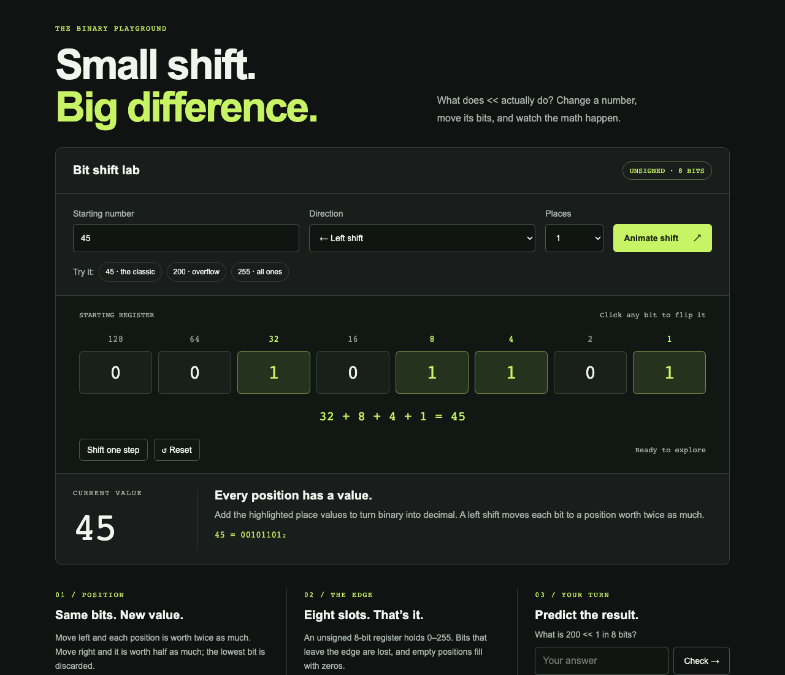

# Bit Shift Lab

An interactive version of the original Manim bit-shift lesson. Built with **Python Flask, HTML, CSS, and JavaScript**. Enter an unsigned byte, flip individual bits, animate left or right shifts, step through multiple shifts, and predict the overflow example.

[Open Bit Shift Lab](https://greglafauci.github.io/CS_MATH/) · [Source](https://github.com/GregLaFauci/CS_MATH)



## Run locally

```sh
python3 -m venv .venv
.venv/bin/python -m pip install -r requirements.txt
.venv/bin/python app.py
```

Open http://127.0.0.1:5177. No frontend framework or npm installation is needed. The browser performs all lesson interactions; Flask serves the page and assets.

## GitHub Pages

```sh
.venv/bin/python export_static.py
.venv/bin/python -m http.server 5178 --bind 127.0.0.1 --directory _site
```

The exporter renders the same Flask page into `_site/`. Relative asset URLs work under a repository subpath. GitHub Pages hosts the exported files; it does not run Python. The included GitHub Actions workflow tests and deploys on pushes to `main` or `master`; configure the repository's Pages source as **GitHub Actions**.

## Verify

```sh
.venv/bin/python -m unittest discover -s tests -v
node --test tests/math.test.mjs
```

Tests cover Flask routes, export assets, the original 45 → 90 and 200 → 144 examples, and all 256 unsigned bytes shifted 1–8 places in both directions. Animation honors reduced-motion preferences; Reset cancels an in-progress animation. Inputs and bits are keyboard-accessible.

## Files

- `app.py`: Flask app and local server.
- `templates/index.html`: lesson interface.
- `static/app.js`: controls, animation, explanations, prediction feedback.
- `static/math.mjs`: fixed-width unsigned shift calculations.
- `static/styles.css`: responsive layout.
- `export_static.py`: GitHub Pages export.
- `bit_shift.py`: preserved original Manim source; not required by the browser app.

This is an explicit **unsigned 8-bit simulation**, not JavaScript's native 32-bit integer behavior or Python's unlimited-width integers. Left shifts keep the lowest eight bits; right shifts insert zeros and round down. No MP4, external fonts, or remote services are used by the lesson.
